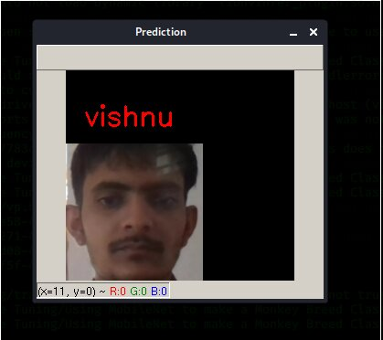

## PROBLEM STATEMENT :
### Using transfer learning creat a model and predict the model 
## Requirment
#### 1.python3
#### 2.Opencv
#### 3.opencv_contrib_python
#### 4.tenserflow 2
#### 5.keras 
#### 6.harcascade file 
#### 7.numpy
## PROCESS IN PHOTO CAPTURING
### 1. first of all ask For which job do you want to capture photo
##### for training press 1 and for testing press 2
### 2. then check the if else condition if value is 1 then run for training purpose and 2 for testing and give invalid number then it is exit.
### 3. take  the number of persons or objects you want to catpures and ask for how much photos you want.
### 4. after all the photos are capures of first person then it is ask for press enter for next person photo capturing .
## PROCESS IN MODEL CREATION AND PREDICTION  USING MOBILENET MODEL :
### 1. First of all i download the Mobilenet data using keras  and  False all the trainable layers using for loop bcz i want to add my own layers on top of mobilenet layers.
### 2. For adding own layers on top of mobilenet output layers so mobilenet output layer assing to the top_model bcz we can't assing own layers on top of  modilenet layer directlly so we create a variable top_model and assign the mobilenet output layer to the top_model variable
### 3. I create three dense layers and using relu activation function and 1 output layers using softmax activation function and add on the top  of top_model variable 
### 4. Using keras.preprocessing.image module we increase our dataset using augmentaiton method here we are perfome the action on the top of image like resize, scaling , rotation etc . it perfome on the both dataset train and test 

### 5. Then after we train our dataset using RMSprop optimizer and give the 5 epoch and  after train model it save our model. and model name is "model.h5"

### 6. using keras we load the our model for prediction 
### 7. Before test our model we give the names of person according to our dataset numbers. it take the dataset from "./model/Test/" directory and predict .

### After prediction 

#### Note :- Number of classes always 2 or more then 2 . bcz here we are using classification 
